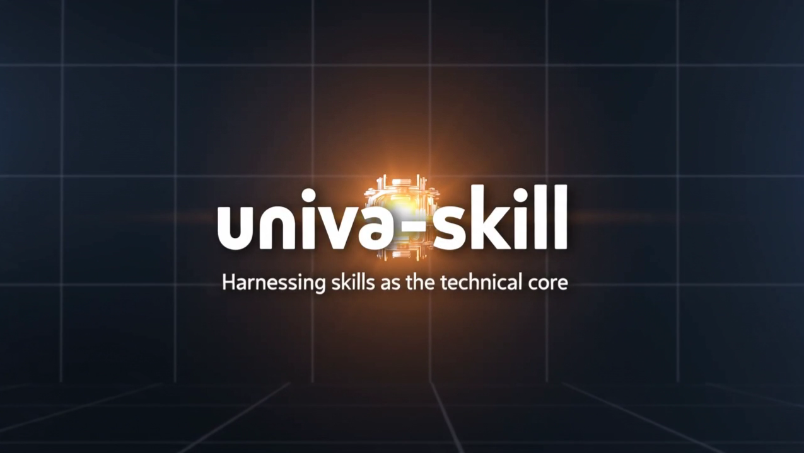

# UniVA-SKILL

<p align="center">
  <a href="https://univa.online"></a>
  <a href="https://arxiv.org/abs/2511.08521"></a>
  <a href="https://huggingface.co/datasets/UniVA-Agent/UniVA-Bench"></a>
  <a href="https://huggingface.co/spaces/UniVA-Agent/UniVA-Leaderboard"></a>
  <a href="https://discord.gg/85GkGW897V"></a>
</p>

<table>
  <tr>
    <td width="50%" align="center">
        
    </td>
  </tr>
</table>

UniVA-SKILL 会把创意请求转化为经过审阅的制作计划，然后通过现有 MCP 媒体工具执行已批准的计划。它面向智能体式视频工作而设计：Codex、Claude Code、后端 API 或 Web 编辑器都可以共用同一套技能系统、审批闸口、用户偏好和交付验证机制。

## UniVA-SKILL 能做什么

| 能力 | 执行内容 |
|---|---|
| 文本生成视频 | 将简短需求扩展为镜头级提示词、时长、转场和最终视频生成请求，通过多重审查确保生成质量。 |
| 图像生成视频 | 在保留视觉锚点和关键要素的同时，让参考图像活灵活现地动起来。 |
| 图像生成/编辑 | 通过同一套审阅闸口生成图像、图像变体和连续图像输出。 |
| 视频编辑 | 为风格迁移、重绘、深度/背景编辑和姿态参考编辑生成经过审阅的编辑提案。 |
| 视频理解 | 分析内容、风格、节奏、结构、可复用提示词和下游编辑建议。 |
| 音频和语音 | 规划并生成 BGM、环境声、音效、转场音、语音等适配于对应视频的音频内容。 |
| 用户偏好 | 将可复用的风格、节奏、镜头、输出和工作流偏好保存为仓库本地技能。 |
| 复合任务 | 通过已有内容，在多轮对话中实现生成、编辑、分析和最终合成。 |
| Web 编辑器 | 提供聊天、媒体库、项目级上传和面向时间线的工作流。 |

## 示例提示词

没有明确构思时，可使用简单的模糊提示词或一句话，UniVA-SKILL 会帮助你扩充内容，加入更多的细节、镜头、分镜等内容。不用担心会生成与预期情节偏差巨大的内容，在生成前可指导修改 UniVA-SKILL自主扩充生成的提示词。

同样，可以提供给 UniVA-SKILL 丰富的提示词规划，UniVA-SKILL会根据审查原则对其进行润色，使得最终提示词能更准确，助力生成更贴合的创作内容。

```text
Generate a 5-second product promo video for an electric sedan.
Analyze this video and extract reusable shot rhythm, camera language, and style prompts.
Convert this video to watercolor animation while preserving motion and composition.
Save preference: future product videos should use calm tech style, minimal transitions, and no voiceover.
Create a three-shot travel video with ambience, smooth transitions, and no narration.
```

## 演示图库

| 风格化生成 | 产品宣传 | 视觉效果 |
|---|---|---|
| [] | [] | [] |
| 中国古风山水画 | 意大利面特写 | 科幻风列车驶向城市 |

### 视频展馆

<table>
  <tr>
    <td width="50%">
      <a href="docs/assets/readme/tokyo-olympics-promo-with-audio.mp4">
        
      </a>
      <br><sub><a href="docs/assets/readme/tokyo-olympics-promo-with-audio.mp4">观看视频</a> - 东京奥运风格宣传片，包含规划后的多镜头合成及分镜包装。</sub>
    </td>
    <td width="50%">
      <a href="docs/assets/readme/stadium-crowd-story.mp4">
        
      </a>
      <br><sub><a href="docs/assets/readme/stadium-crowd-story.mp4">观看视频</a> - 体育观众，动态视角变换，多镜头融合。</sub>
    </td>
  </tr>
  <tr>
    <td width="50%">
      <a href="docs/assets/readme/comic-action-short.mp4">
        
      </a>
      <br><sub><a href="docs/assets/readme/comic-action-short.mp4">观看视频</a> - 漫画风动作短片，包含风格化运动、字幕和角色聚焦构图。</sub>
    </td>
    <td width="50%">
      <a href="docs/assets/readme/desert-car.mp4">
        
      </a>
      <br><sub><a href="docs/assets/readme/desert-car.mp4">观看视频</a> - 沙漠越野车短片，红色车辆，突出光影。</sub>
    </td>
  </tr>
</table>

## UniVA-SKILL 的不同之处

UniVA-SKILL 不只是视频模型的封装器。它是一层制作控制系统。

- **技能驱动执行**：每项能力都作为技能契约记录在 `skills/` 下，提供规范稳定的工作流。
- **MCP 原生工具**：生成、编辑、理解、音频、合并和跟踪以模块化 MCP 工具暴露，灵活可变。
- **生成前审阅**：会产生或修改媒体的工具必会停在具体的计划/审阅处，确认再进入执行，保障生成质量。
- **精确交接已批准内容**：最终工具调用使用已批准的提示词、时间、源路径、参考和参数进行最终调用，避免浪费额度。
- **智能体友好**：Codex 和 Claude Code 无需启动后端即可直接使用 UniVA 中全部 skills 内容。
- **前端就绪**：通过项目自带后端实现支持 Web 聊天、上传、项目上下文和工作流的 Web 界面。
- **偏好记忆**：创建多个用户级偏好技能，指导后续输出，使生成内容带有自己独特风格。

## 架构

```text
User request
  -> Skills and preference loading
  -> Intent routing
  -> Plan / proposal / storyboard
  -> Validation and human review
  -> Approved MCP tool execution
  -> Output verification
  -> Delivery report
```

```text
skills/
  core/              MCP tool contracts
  creative/          prompt, brief, story, style, duration, audio, quality guidance
  meta/              routing, review, checkpoint, output, preference protocols
  themes/            generation quality enhancers
  pipelines/         stage director skills

pipeline_defs/       executable pipeline manifests
univa/mcp_tools/     image, video, audio, editing, understanding, tracking tools
scripts/             direct runners, clients, preflight, tool contract export
apps/web/            Next.js editor and chat frontend
```

## 快速开始

最快路径是 **外部智能体技能协作**。它不需要 Web 前端，也不需要运行中的后端服务器。当 Codex、Claude Code 或其他终端智能体操作本仓库时，使用这种方式。

### 1. 环境要求

- Python 3.10+
- FFmpeg 和 ffprobe
- 计划使用的供应商 API 访问权限，通常是 Wavespeed 和/或 Ark

检查：

```bash
python --version
ffmpeg -version
ffprobe -version
```

### 2. 创建 Python 环境

Linux，并且 CUDA 环境匹配：

```bash
python -m venv .venv
source .venv/bin/activate
python -m pip install -U pip setuptools wheel
pip install -r requirements.txt
pip install mcp==1.27.2 httpx-sse==0.4.3
```

Linux CPU、CUDA 不匹配或 Windows：

```bash
python -m venv .venv
source .venv/bin/activate
python -m pip install -U pip setuptools wheel
pip install -r requirements.runtime.txt
pip install mcp==1.27.2 httpx-sse==0.4.3
```

`requirements.runtime.txt` 供 CPU、CUDA 不兼容或 Windows 环境使用。它会移除 CUDA/PyTorch 固定项，例如 CUDA PyTorch index、`cuda-*`、`nvidia-*`、`triton*`、`torch==*`、`torchvision==*` 和 `torchaudio==*`。

这套过滤安装足以支持基于 API 的编排、后端、MCP 路由、FFmpeg 合并/合成，以及供应商 API 型的图像/视频/音频生成。它不会安装 PyTorch。依赖本地 checkpoint 的能力，例如本地视频理解、视频跟踪或本地视频编辑，仍然需要安装与你平台匹配的 PyTorch，并配置对应模型路径。

Windows PowerShell 使用同样的过滤安装方式，但激活命令改为：

```powershell
py -m venv .venv
.\.venv\Scripts\Activate.ps1
py -m pip install -U pip setuptools wheel
py -m pip install -r requirements.runtime.txt
py -m pip install mcp==1.27.2 httpx-sse==0.4.3
```

Conda 也可以使用。请选择一种环境方式并保持一致：

```bash
conda create -n univa python=3.10
conda activate univa
python -m pip install -U pip setuptools wheel
python -m pip install -r requirements.runtime.txt
python -m pip install mcp==1.27.2 httpx-sse==0.4.3
```

如果在 Windows 原生 Python 下而不创建虚拟环境，需要把依赖安装到实际运行 UniVA 的那个解释器：

```powershell
py -m pip install -U pip setuptools wheel
py -m pip install -r requirements.runtime.txt
py -m pip install mcp==1.27.2 httpx-sse==0.4.3
```

这种方式不推荐用于开发，因为它会修改用户/全局 Python 包集合。如果采用这种方式，后续生成 MCP 服务器配置时也要使用同一个 `py -3.10` 解释器。


### 3. 创建本地目录

```bash
mkdir -p results cache temp/config/univa data
```

### 4. 配置 `.env`

编辑仓库根目录的 `.env` 文件。

填写计划使用的 API key 和供应商选择，尤其是 `PLAN_MODEL_API_KEY`、`ACT_MODEL_API_KEY`、`LLM_OPENAI_API_KEY`、`WAVESPEED_API_KEY`、`ARK_API_KEY`
非敏感 MCP 默认值，例如模型名称、base URL、合并设置和默认视频音频行为，放在 `univa/config/mcp_tools_config/config.yaml` 中。密钥和机器相关覆盖项放在 `.env` 中；只有在明确要覆盖 YAML 默认值时，才在 `.env` 中添加模型或音频覆盖变量。不要提交真实密钥。

### 5. 生成 MCP 服务器配置

所有 MCP 服务器都必须指向实际运行 UniVA 的同一个 Python 解释器。请先激活 `venv` 或 conda 环境；如果在 Windows 下不使用虚拟环境，则这里也使用同一个 `py -3.10` 解释器。

```bash
python scripts/configure_mcp_servers.py
```

Windows PowerShell 且不使用虚拟环境：

```powershell
py scripts/configure_mcp_servers.py
```

如果需要显式指定 MCP 服务器使用某个解释器，传入 `--python /path/to/python`。

### 6. 预检

```bash
python scripts/preflight_media_runtime.py
```


## 通过外部编码智能体使用 UniVA-SKILL

对于 Codex 等外部智能体辅助驱动的视频生成，在打开外部智能体后可直接输入对应指令，智能体会自动读取相关skills并实现任务


## 可选：后端 API

当你需要 CLI 交互、FastAPI、会话、认证、流式输出、暂停/恢复或 Web 前端时，使用后端。

```bash
python univa/univa_agent.py
python -m univa.univa_server
curl http://127.0.0.1:8000/health
```


API 客户端：

```bash
python scripts/univa_agent_client.py chat --prompt "Show my preferences" --show-session
python scripts/univa_agent_client.py resume --session-id <session_id> --user-input "Confirm execution"
```

## 可选：Web 编辑器

Web 编辑器提供上传、媒体库、聊天、项目上下文、审批卡片和面向时间线的编辑界面。

```bash
python -m univa.univa_server
```

在另一个终端中：

```bash
cd apps/web
bun install
cp .env.example .env.local
bun dev
```

最低限度的 `apps/web/.env.local`：

```dotenv
AGENT_API_URL=http://127.0.0.1:8000
NEXT_PUBLIC_AGENT_API_URL=http://127.0.0.1:8000
```

打开 `http://127.0.0.1:3000`。

## 媒体审阅闸口

UniVA 有意将规划和执行分离：

1. 加载技能和契约。
2. 调研或分析参考。
3. 创建可执行的计划或提案。
4. 写入验证/审阅产物。
5. 停在 `awaiting_human` 等待用户确认或修改。
6. 执行已批准的计划版本。
7. 验证真实输出文件并写入 `delivery_report.json`。

这适用于视频、图像、音频、语音、生成资产、风格迁移、重绘、替换、扩展、合成和复合媒体任务。

## 工具覆盖

| 领域 | 工具 |
|---|---|
| 视频生成 | `plan_video_shots`, `text2video_gen`, `image2video_gen`, `frame2frame_video_gen`, `video_extension`, `storyvideo_gen`, `entity2video` |
| 图像生成 | `text2image_generate`, `image2image_generate`, `sequential_image_gen` |
| 视频编辑 | `depth_modify`, `style_transfer`, `repainting`, `pose_reference` |
| 视频理解 | `vision2text_gen` |
| 视频跟踪 | `video_referring_segmentation` |
| 音频和语音 | `audio_gen`, `speech_gen`, `plan_audio_for_video`, `generate_audio_assets_from_plan`, `mux_audio_timeline` |
| 合成 | `merge2videos`, `remotion_compose_video` |


## 代码库结构

```text
apps/
  web/                       Next.js 编辑器、聊天界面、项目工作区、上传能力和 API routes

packages/
  auth/                      共享认证辅助代码
  db/                        共享数据库 schema、迁移和类型化访问辅助代码
  remotion-compose/          用于最终视频包装的 Remotion 合成项目
  video-export/              时间线到导出产物的工具与视频导出管线代码

univa/                       Python 智能体运行时、后端入口、提示词和编排逻辑
  auth/                      后端认证模型、中间件和管理员命令
  config/                    运行时配置以及生成的 MCP 服务器配置
  mcp_tools/                 图像、视频、音频、编辑和跟踪等 MCP 工具实现
  prompts/                   规划、生成、理解和跟踪使用的提示词模板
  utils/                     共享媒体处理、模型、管线、上传和格式化工具

skills/                      面向智能体的工具契约、工作流规则、主题和用户偏好
  agent-integrations/        外部智能体运行参考
  core/                      详细约束工具
  creative/                  负责创意扩展和质量提升
  meta/                      全流程所需协助内容
  pipelines/                 流水线进程规范
  themes/                    生成主题指导
  user/                      用户级别偏好

pipeline_defs/               将技能绑定为可执行阶段的 YAML 管线清单
schemas/                     artifact、checkpoint、review 和 delivery report 的 JSON schema
scripts/                     直接运行器、API 客户端、预检、配置生成和维护工具
tests/                       覆盖运行时、技能、工具和编排行为的 Python 测试
docs/                        项目文档资产、README 媒体和论文/演示材料
data/                        本地项目上传和工作区媒体；保留用户提供的内容
results/                     生成的计划、审阅、媒体输出和交付 artifact
logs/                        运行时和 MCP 工具日志
temp/                        开发或执行过程中产生的本地临时/配置状态
```

